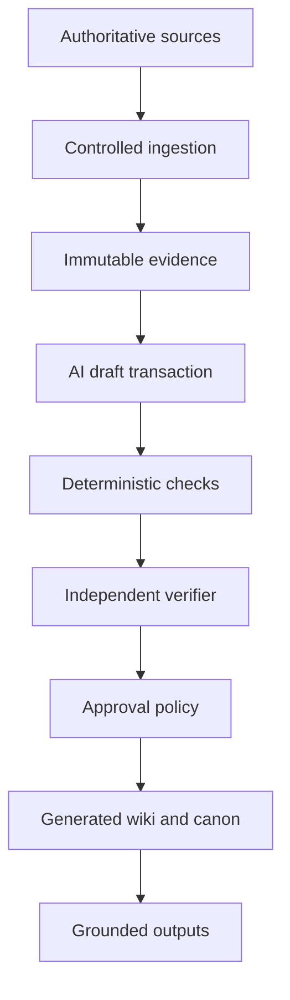

# Architecture overview

## Purpose

TITR-SecondBrain compiles selected evidence into persistent, source-grounded Markdown knowledge that supports thinking and internal operations. It does not replace Microsoft 365, Git repositories, CRM, accounting, time tracking, document management, or ConsultancyOS.

## Logical pipeline

## Knowledge layers

| Layer | Contents | Default agent access |
|---|---|---|
| Authoritative sources | Microsoft 365, Git, CRM, finance and original documents | Scoped read-only |
| Evidence | Immutable snapshots, hashes, stable pointers and metadata | Read-only |
| Drafts | Proposed notes, claims, links, summaries and changes | Read/write |
| Generated wiki | Reversible, cited synthesis and navigation | Transactional write |
| Human canon | Approved decisions, commitments, policies and sensitive facts | Propose only |
| Outputs | Briefs, reports, drafts and prepared actions | Create |
| Audit | Operation, verification, approval and application records | Append-only |

## Transaction model

A mutation is a plan before it is a write.

1. Capture the input scope and source hashes.
2. Produce a proposed file-level change set.
3. Run schema, link, provenance, classification, secret, and boundary checks.
4. Have a separate read-only verifier evaluate evidence coverage.
5. Classify each write as re-derivable, reversible, or high impact.
6. Auto-apply only explicitly authorised re-derivable operations.
7. Present reversible and high-impact diffs for the required approval.
8. Apply the exact approved transaction and append an audit record.
9. Retain the previous version through Git and backup.

## Retrieval

Retrieval is scoped before it is semantic:

1. security domain and client/project boundary;
2. knowledge status and classification;
3. direct links and indexes;
4. exact/full-text search;
5. optional hybrid semantic retrieval;
6. reranking and context minimisation.

Search indexes are derived and disposable. They never become the source of truth.

## Initial deployment

### User workstation

Obsidian, approved sync, VS Code, agent runtime, Git client, local validation, and backup client.

### Controlled server environment

n8n, Microsoft Graph integration worker, execution database, private Git service, backup/object storage, and observability.

### ConsultancyOS

A future internal surface for briefs, search, evidence, health status, and approval queues. It remains an internal aggregation interface, not a new SaaS platform.

## Explicit non-goals

- Multi-tenancy
- Client-facing SaaS
- Replacing source applications
- Unsupervised financial or legal decisions
- Autonomous external communications
- Training a foundation model
- Building a general-purpose SDK or API abstraction layer
